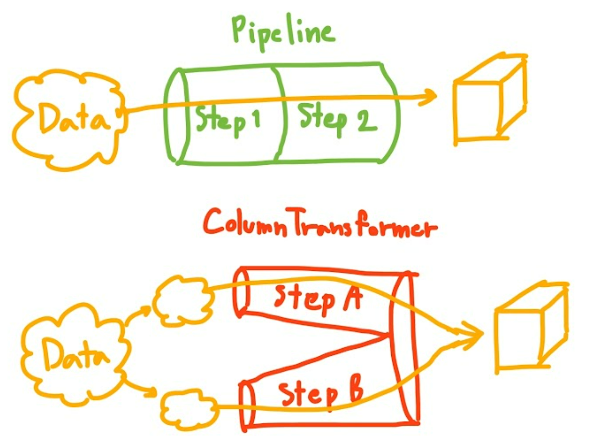

# Analysis of Student Performance in Exams
The objective of this project is to understand the influence of the parents background, test preparation, etc. on students performance.

## Dataset - Student Performance in Exams
The link to the dataset: https://www.kaggle.com/code/spscientist/student-performance-in-exams/input

Description: 
This data set consists of the marks secured by the students in various subjects.

## Project Development Phases
### Phase 1: Data Ingestion
Read data from any kind of storage such as database, cloud storage like blob storage, or anything.
In this phase:
1. CSV data is read and converted into pandas to dataframe.
2. Then the dataset is splitted into training set (80%) and testing set (20%).

### Phase 2: Data Transformation
All the transformation of data will be implemented under this component such as to encode the data using encoding techniques such as label encoding or one-hot encoding.
In this phase:
1. Numerical columns and categorical columns are separated.
2. Built machine learning pipeline for numerical features to handle missing values (if any) with a strategy of 'median' and scaled the features.
3. Built machine learning pipeline for categorical features to handle missing values (if any) with a strategy of 'most frequent', then encoded them using one-hot encoder and then scaled the features.
4.Transformation on numerical features and categorical featires are applied using Column Transformer and saved in a pickle file.

### Phase 3: Model Training
Model will be trained under this component to predict the student's score in Maths subject.
This a classification problem, therefore various classification algorithms are used such as Linear Regression, Random Forest, Decision Tree, etc.
In this phase:
1. All the models are trained and evaluated.
2. Hyperparameter tuning is performed to optimize the performance of the models.
3. The best model is saved as a pickle file, which can be used to predict the Maths score for the new students (or new data).

### Phase 4: Prediction Pipelines
In this phase, prediction pipeline is built to predict the Maths score of new students.

### Phase 5: FastAPI Web App
In this phase, I have used FastAPI to create a web interface for predicting the score of student's in the Maths subject.

## Features
-> Predict performance of students in the Maths subject.
-> Web Interface to predict the student's score in Maths by providing the required information.
-> Built a pipeline for the prediction.
-> Observed valuable insights on the student's performance on the basis of various factors.

## Installation
1. Clone the repo: 
git clone https://github.com/Shreya168sh/StudentPerformanceAnalysis.git
2. Navigate to the project directory: 
cd StudentPerformanceAnalysis
3. Install the required python packages from the following command: 
pip install -r requirements.txt

### Note
The -e . in the requirements file is:
-e, --editable <path/url>
-e is short for --editable, and . refers to the current working directory, so together, it means to install the current directory (i.e. your project) in editable mode.
This is used to install a package locally, most often in the case when you are developing it on your system. It will just link the package to the original location, basically meaning any changes to the original package would reflect directly in your environment.

## Usage
1. Run the application: python3 application.py
2. Access the web interface in the browser at:
http://localhost:8084/docs
3. To predict the Maths score of a student, fill the required student information under the pridiction route by clicking on "Try it out" button on upper right corner.

## Project Structure
📁 StudentPerformanceAnalysis/    
├─📁 .ebextensions/    
├─📁 artifacts/    
├─📁 catboost_info/    
├─📁 config/    
├─📁 logs/    
├─📁 notebooks/    
│ ├─📁 data/        
├─📁 src/  
│ ├─📁 components/    
│ ├─📁 pipeline/    
